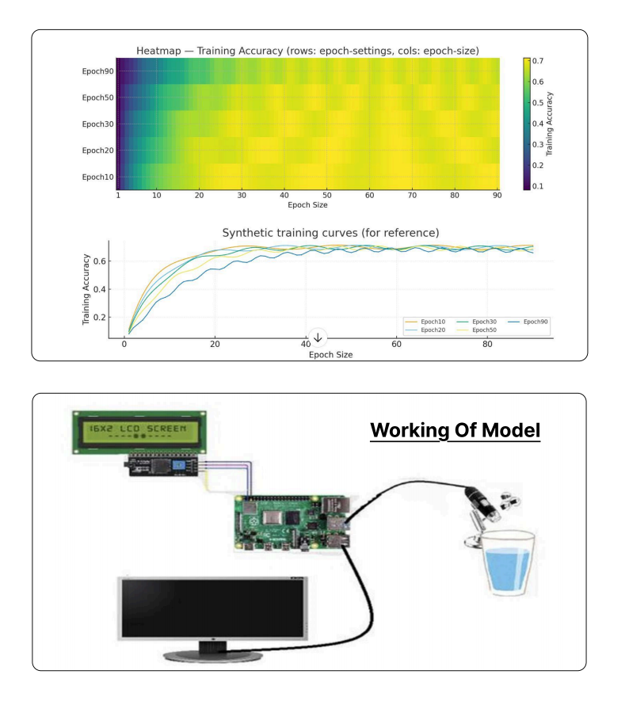

---

## 🧩 System Architecture & End-to-End Workflow

### 🔄 Overall System Flow Diagram

This flow diagram represents the complete operational pipeline of **Neerakshak**, highlighting how hardware, software, and AI components interact to enable real-time microplastics detection.

**Workflow Breakdown:**
1. **Hardware Setup**  
   A Raspberry Pi acts as the central controller, interfacing with a USB microscope and LED display.
2. **Image Acquisition Phase**  
   Water samples are captured using a microscope, producing high-resolution microscopic images.
3. **Processing Phase**  
   Captured images are passed to a lightweight deep-learning model for inference.
4. **Detection & Quantification**  
   The model detects microplastic particles, generates bounding boxes, and calculates counts with confidence scores.
5. **Annotation & Visualization**  
   Detected particles are visually annotated on the image.
6. **Display Phase**  
   Quantified results are instantly shown on the LED display for on-site feedback.
7. **Data Synchronization Phase**  
   Annotated images and metadata are uploaded to a cloud database.
8. **Dashboard Phase**  
   Users can remotely view results, historical trends, and contamination reports through a web dashboard.

---

## 🧠 AI Model Training, Evaluation & Performance Analysis

The above visualizations summarize the training behavior and performance characteristics of the microplastics detection model.

### 📊 Training Accuracy Heatmap
- Shows training accuracy variation across different epoch configurations
- Helps identify optimal epoch-size trade-offs
- Confirms model stability with increasing training duration

### 📈 Synthetic Training Curves
- Demonstrate smooth convergence of the model
- Highlight diminishing returns beyond certain epoch sizes
- Used to guide efficient training for deployment on edge devices

**Model Characteristics:**
- Lightweight architecture suitable for Raspberry Pi
- Optimized for low-latency inference
- Trained on real microscopic water sample images
- Outputs bounding boxes, particle counts, and confidence scores

---

## ⚙️ Hardware Setup & Working of the Model

This diagram illustrates the physical and logical working of the Neerakshak system.

### 🔌 Hardware Components
- **Raspberry Pi** – Central processing and control unit
- **USB Microscope** – Captures microscopic images of water samples
- **LED Display** – Displays real-time quantification results
- **External Monitor** – Used for live visualization and debugging

### 🧪 Operational Flow
1. Water sample is placed under the microscope
2. Image is captured and processed on the Raspberry Pi
3. AI model performs detection and quantification
4. Results are displayed locally on the LED screen
5. Data is optionally pushed to the cloud for long-term monitoring

The modular design allows the system to be adapted for different microscopes and deployment environments such as rivers, drinking water sources, and industrial effluents.

---

## 🌐 Live Web Application Deployment

The Neerakshak dashboard has been deployed as a web application to enable **remote monitoring and visualization**.

🔗 **Deployed Application:**  
https://projectneerakshak.streamlit.app

### 🌍 Dashboard Capabilities
- View annotated sample images
- Monitor microplastics concentration levels
- Analyze historical contamination trends
- Maintain cloud-backed records for decision-making

---

## 🎥 Project Demonstration Video

A complete walkthrough of the system, including hardware setup, AI detection, and dashboard usage, is available below.

▶️ **YouTube Demo Video:**  
https://www.youtube.com/watch?v=5TFooocB-3Q

---

